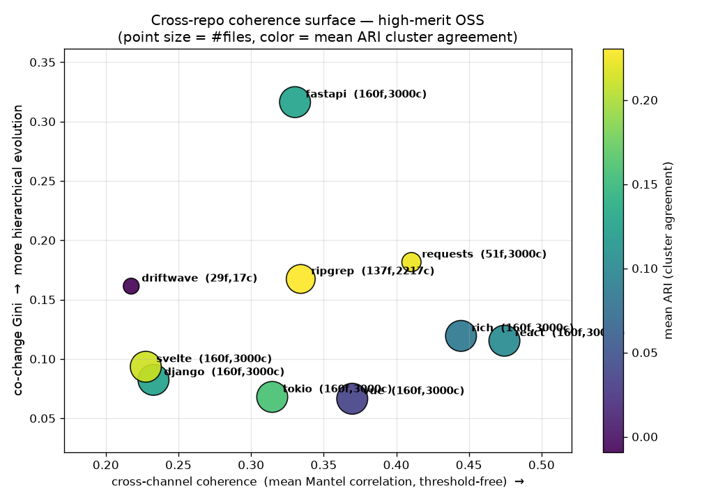
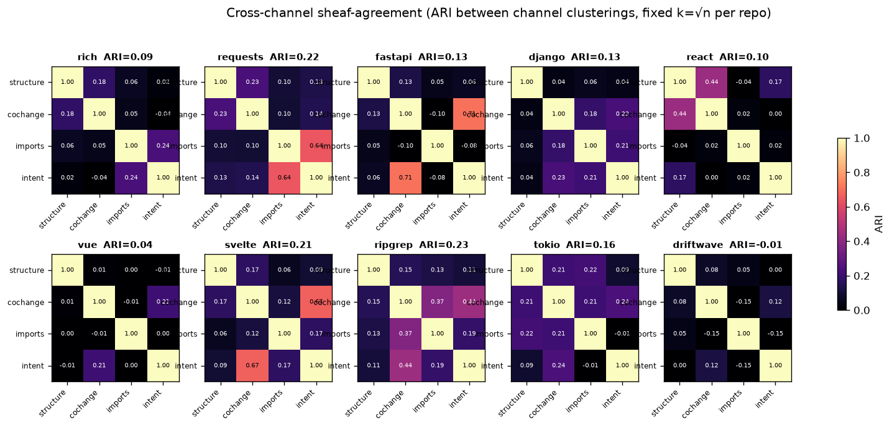
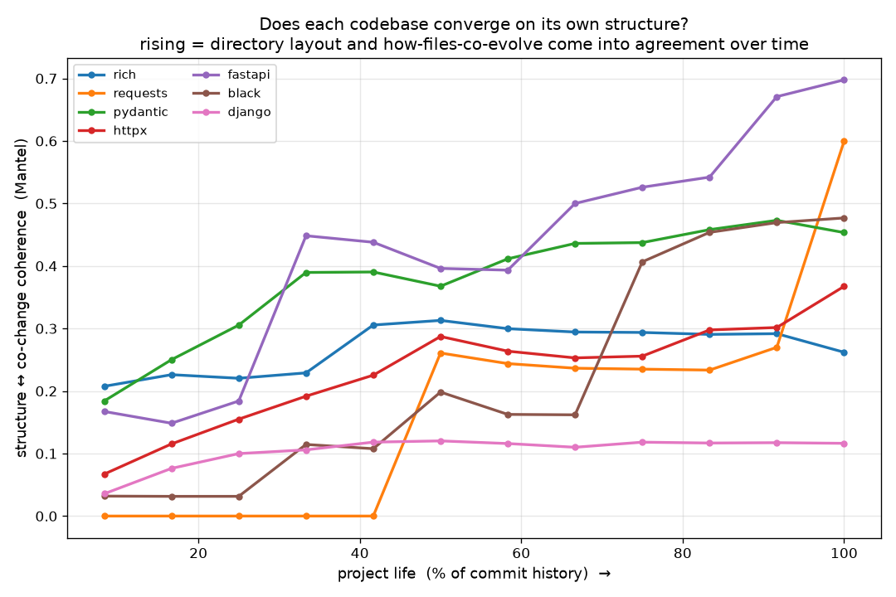

# driftwave coherence-bench

Multi-channel **codebase design-coherence analysis** — driftwave's topology
applied to real repositories instead of to itself.

The premise (and the reason this lives in driftwave): a repository's *intent and
evolution are already encoded* in its files and its commit history, at both low
and high dimension. This tool extracts that structure with the same mathematics
driftwave uses internally — persistent homology and sheaf-consistency — and
turns it into comparable, plottable coherence signals.

## The idea in one paragraph

Encode every source file as a point under **four independent distance channels**,
run **H₀ persistent homology** per channel, then measure how much the channels
**agree** on the same module structure. Agreement *is* coherence: in a
well-designed codebase the directory layout, the way files co-evolve, the import
graph, and what the files are *about* all carve out the same modules. When they
disagree, the design is drifting.

## The four channels (the encoder is the lever)

| channel | distance | what it reads |
|---|---|---|
| **structure** | directory-tree geodesic + log-size + language | how the code is *filed* |
| **cochange** | `1 − Jaccard` of commits touching both files | how the code *evolves* (git history) |
| **imports** | `1 − cosine` of import-graph adjacency rows (Python / JS / Rust) | how the code *depends* |
| **intent** | cosine of MiniLM embeddings of *(commit messages + file content)* | what the code is *about* |

`intent` defaults to a hand-rolled TF-IDF (numpy-only); set `INTENT_MODE=neural`
to use sentence-transformers (`all-MiniLM-L6-v2`) on GPU/CPU instead.

## Metrics

- **Mantel correlation** — Pearson correlation between two channels' distance
  matrices (upper triangle). **Threshold-free and robust** — this is the
  headline coherence metric.
- **ARI@k** — Adjusted Rand Index between two channels' clusterings, where every
  channel is cut to the **same `k = √n` clusters** so the comparison is
  apples-to-apples. (A single distance threshold was the dominant source of
  instability; fixing `k` removed it.)
- **co-change Gini** / **persistence entropy** — concentration vs. uniformity of
  the H₀ barcode (is a few modules' worth of structure dominant, or is it flat?).
- **temporal meta-persistence** — recompute the structure↔cochange coherence in
  cumulative windows across the commit history → a trajectory (the "barcode of
  barcodes"): does a codebase *converge on its own structure* over its life?

## What we found (10 repos, Python / JS / Rust + a CC plugin)



1. **Coherence is language-agnostic.** The top of the ranking interleaves
   react (JS), rich (PY), requests (PY), vue (JS), ripgrep (Rust). The metric
   measures structural coherence, not "Python-ness."
2. **`structure ↔ imports` is the universal backbone** — the strongest channel
   pair in almost every repo: in good libraries the directory layout *mirrors*
   the import graph.
3. **Codebases converge on their structure over time.** Most repos' co-change
   structure drifts *into* agreement with their final layout
   (requests 0.00→0.60, fastapi 0.17→0.70), while some are "born organized"
   (rich) and a few never converge (django). The kinks are real refactors.
4. **Mantel and ARI@k are different facets** — some repos' channels correlate
   continuously but don't carve identical partitions, and vice-versa. A repo's
   position in the (Mantel, ARI) plane is a fingerprint.
5. **Neural embeddings rescue the pathological case** — a topically-uniform
   codebase (e.g. the `black` formatter) collapses the TF-IDF intent channel;
   MiniLM gives it real structure. But the robust (Mantel) ordering barely
   changes — the encoder choice matters less than the clustering layer.




## Honest limitations

- **Small-repo floor.** Below ~40 files / ~hundreds of commits the signal is
  noise (the driftwave plugin's own repo: 29 files, 17 commits → ARI ≈ 0). The
  method needs real history and size.
- **Fixed-k forces `n_clusters = k`**, so a near-degenerate channel still gets
  merged into `k` clusters — fair for comparison, but it can inject mild noise.
  Mantel stays the cleaner metric.
- **Import resolution is basename-matching** — good enough for libraries, but
  under-resolves large frameworks with deep cross-package imports (django).
- **O(n²)** distance matrices — files are capped at `MAX_FILES` (sampled by
  churn); fine for libraries, needs sparsification for monorepos.
- **TF-IDF/embeddings read file *content*, not diffs** — embedding the actual
  per-commit *changes* would read intent more directly (next upgrade).

## Usage

```bash
pip install -r requirements.txt                 # numpy, scipy, matplotlib
# optional, for INTENT_MODE=neural: pip install torch transformers

# default corpus
python bench.py

# your own corpus (name=giturl ...); writes plots + fingerprints.json to out/
python bench.py mylib=https://github.com/org/mylib.git other=https://github.com/org/other.git

# neural intent channel (GPU if available) -> out_neural/
INTENT_MODE=neural python bench.py mylib=https://github.com/org/mylib.git

# temporal evolution trajectories (reuses the clones under repos/)
python temporal.py
```

Outputs: `out/` (or `out_neural/`) with `barcodes.png`, `agreement.png`,
`refinement_scatter.png`, `fingerprints.json`; `temporal.py` adds
`evolution_coherence.png` and `evolution_gini.png`.

## Files

- `bench.py` — clone → encode (4 channels) → H₀ persistence → cross-channel
  agreement → plots + fingerprints.
- `temporal.py` — temporal meta-persistence trajectories.
- `figures/` — reference plots from the 10-repo cross-language run.
